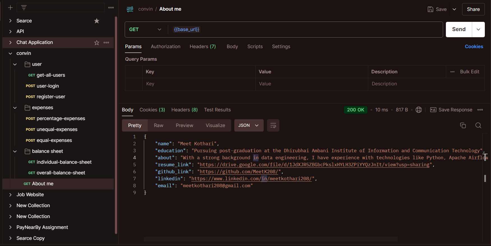
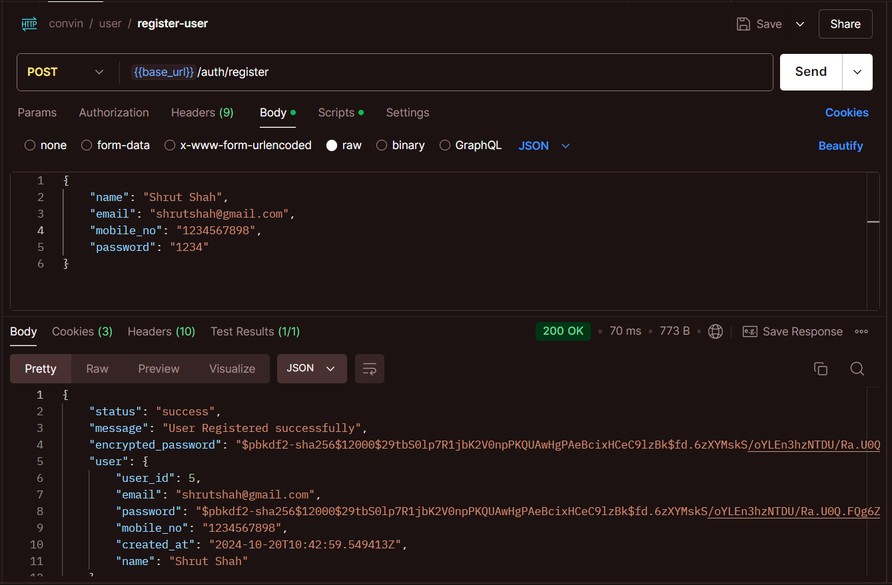
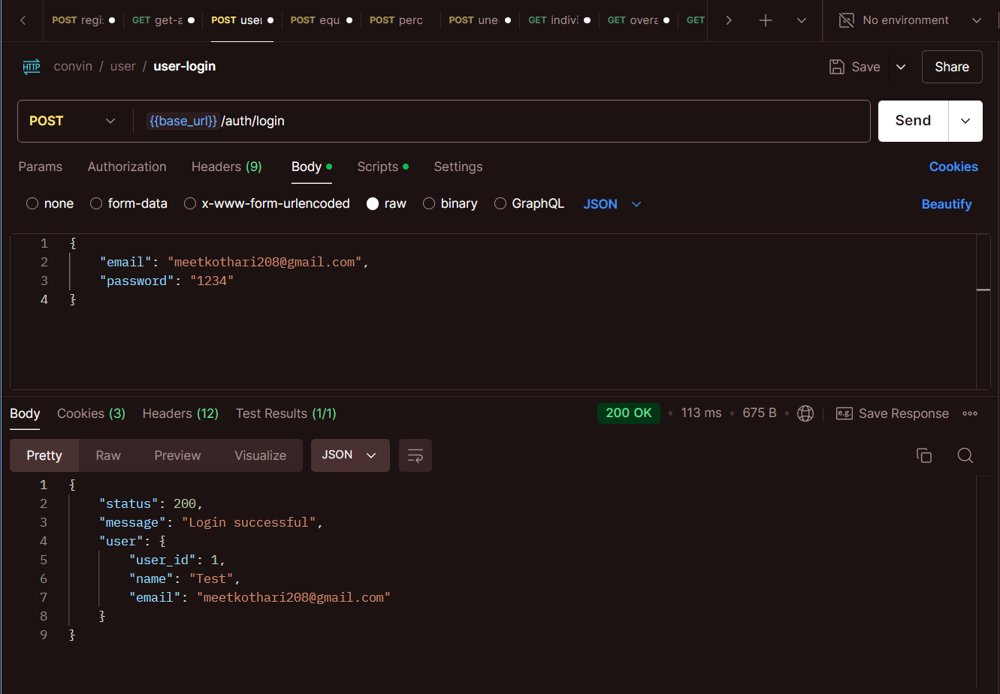
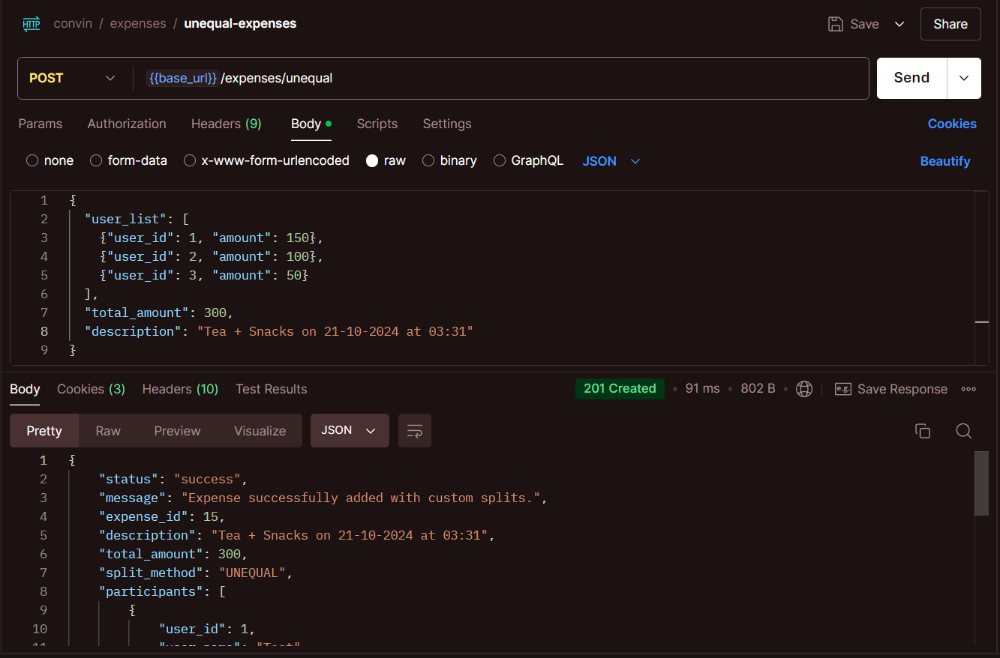
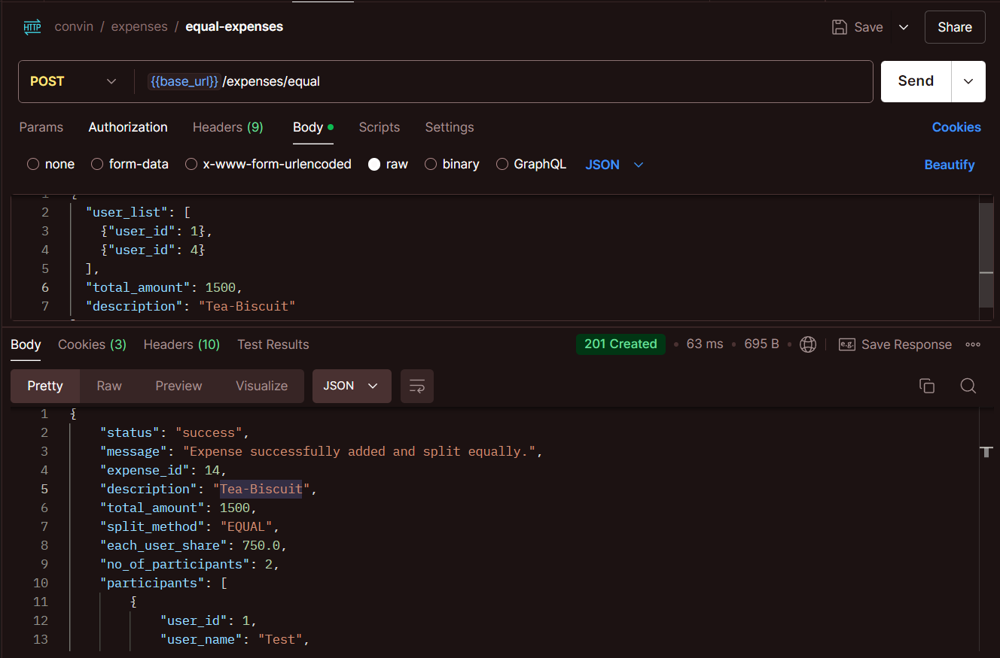
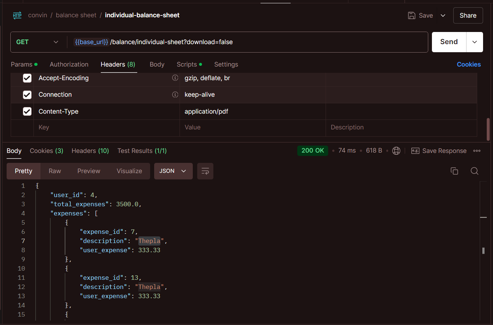
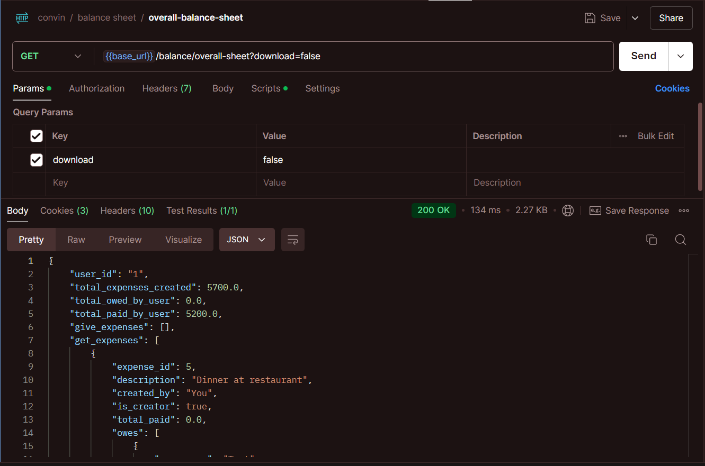
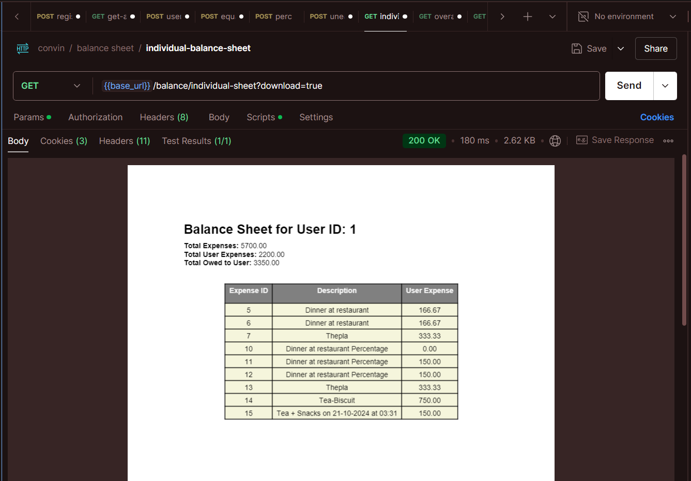
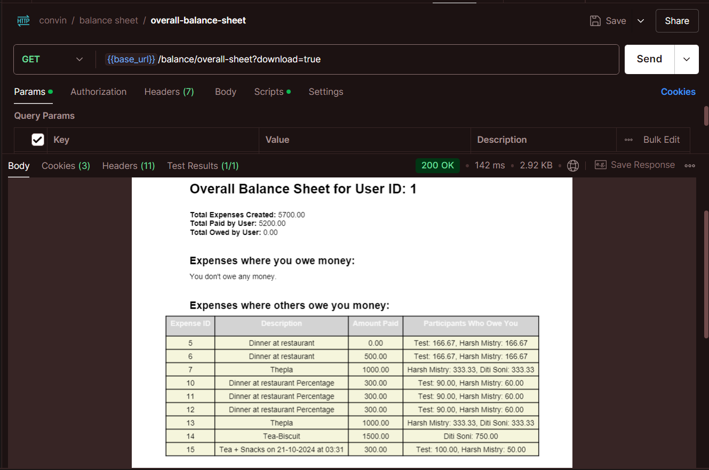

## Base URL Page with My Introduction

This is the homepage of the application, showcasing my introduction, educational background, and links to my resume, GitHub, and LinkedIn profiles.

## View Registered Users

This screenshot displays the endpoint that lists all registered users in the application with pagination support. It retrieves and shows user information like customer ID and name.

---

## User Registration

This endpoint allows a new user to register in the application by providing necessary details like name, email, and password.

---

## Login User Endpoint

After a user is registered, this endpoint handles login functionality, allowing users to authenticate and access their accounts.

---

## Add Expense

This screenshot shows how a user can add an expense to the application by providing details like amount, description, and participants involved in the expense.

---

## View Expenses

This page displays all the expenses added by the user, providing an overview of the amount spent and shared among users.

---

## Individual Balance Sheet without PDF

This screenshot shows the individual balance sheet, which calculates how much a user owes or is owed by others for the expenses they are involved in. No PDF is generated in this view.

---

## Overall Balance Sheet without PDF

This shows the overall balance sheet that gives an aggregate view of all expenses and balances for all participants. No PDF is generated in this view.

---

## Individual Balance Sheet with PDF

This screenshot demonstrates the individual balance sheet with the option to download the balance sheet as a PDF, making it easier to share or keep records.

---

## Overall Balance Sheet with PDF

This shows the overall balance sheet with the option to download the balance sheet as a PDF, providing a comprehensive summary of all expenses shared among participants in the application.

---
